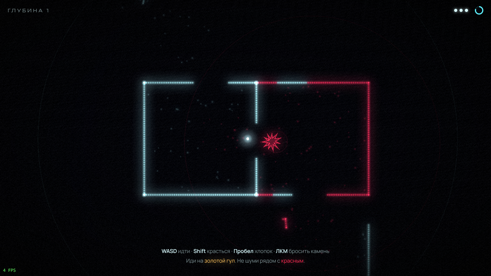

# ЭХО

**Ты не видишь. Ты слышишь. И оно — тоже.**

Стелс-хоррор в полной темноте, где мир проявляется только звуком. Каждый шаг, хлопок и брошенный камень
«рисуют» стены светящимися точками, но слепые Слушатели идут на любой шум.



- [Дизайн-документ](docs/GDD.md)
- [Общий план проекта и тематики](docs/PLAN.md)

## Запуск

```bash
npm install
npm run dev        # http://localhost:5173
```

| Команда | Что делает |
|---|---|
| `npm run dev` | Дев-сервер с hot-reload |
| `npm test` | Тесты логики (Vitest) |
| `npm run typecheck` | Проверка типов |
| `npm run build` | Продакшн-сборка в `dist/` (статический сайт, работает с любого хостинга) |

Параметры URL: `?seed=42` — фиксированный сид уровней, `?debug` — отладочный оверлей (F1) и объект `echo` в консоли.

## Управление

**WASD** — идти · **Shift** — красться · **Пробел** — хлопок · **ЛКМ** — бросить камень · **Esc** — пауза · **R** — заново · **M** — звук

🎧 Играть лучше в наушниках: выход находится по звуку.

## Стек

TypeScript · Vite · PixiJS 8 (WebGL) · pixi-filters · Web Audio API (весь звук процедурный) · Vitest

## Структура

```
src/
  core/     игровой цикл с фиксированным шагом, математика, RNG с сидом
  game/     чистая логика без рендера: конфиг баланса, генератор уровней, World (волны, эхо, ИИ)
  render/   PixiJS: эхо-частицы, камера, bloom, ударные волны, тряска
  audio/    процедурный звук и реверберация
  input/    клавиатура и мышь
  ui/       DOM-HUD и экраны
  app/      связка: состояния игры, события → звук и эффекты
tests/      тесты логики
docs/       дизайн-документ и план
```

Логика (`src/game`) не зависит от рендера и браузера, поэтому её можно тестировать и гонять
симуляции баланса без графики. Все числа баланса лежат в `src/game/config.ts`.
